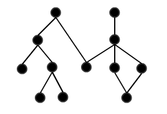

# Getting started


## Installation

PHP-DI works with **PHP 5.3** or higher. But seriously, use 5.4 or even 5.5.

The easiest way is to install PHP-DI with [Composer](http://getcomposer.org/doc/00-intro.md).
Create a file named `composer.json` in your project root:

```json
{
    "require": {
        "mnapoli/php-di": "~4.0"
    }
}
```

Then, run the following commands:

```bash
$ curl -s http://getcomposer.org/installer | php
$ php composer.phar install
```

If you don't use Composer, you can directly [download](https://github.com/mnapoli/PHP-DI/releases) the sources and configure it with your autoloader.


## Usage


### 1: Define dependencies


You have to define a dependency graph between your objects, which we can represent like so (nodes are objects, links are dependencies):



PHP-DI offers several ways to define dependencies, so use which ones you like.

Below is a quick introduction to some options, but you can also read [the full documentation](definition.md).


#### Autowiring

PHP-DI can use [PHP Reflection](http://fr.php.net/manual/fr/book.reflection.php) to understand what parameters a constructor needs:

```php
class Foo {
    private $bar;

    public function __construct(Bar $bar) {
        return $this->bar = $bar;
    }
}
```

PHP-DI will know that it should inject an instance of the `Bar` interface or class.

**No configuration needed!**

Of course, this is limited to constructor injection.

#### Annotations

You can also use annotations to define injections, here is a short example:

```php
<?php

class Foo {
    /**
     * @Inject
     * @var Bar
     */
    protected $bar;

    /**
     * @Inject
     */
    public function setBaz(Baz $bin) {
    }

    /**
     * @Inject({"db.host", "db.port"})
     */
    public function setValues($param1, $param2) {
    }
}
```

See also the [complete documentation about annotations](definition.md).

#### PHP array

You can define injections with a PHP array too (this example uses PHP 5.4 and 5.5 features):

```php
<?php
return [

    // Values
    'db.host' => 'localhost',
    'db.port' => 5000,

    // Class
    MyDbAdapter::class => DI\object()
        ->withConstructor(DI\link('db.host'), DI\link('db.port')),

];
```

See also the [complete documentation about array configuration](definition.md).

You need to configure the container to import this file:

```php
$builder = new ContainerBuilder();
$builder->addDefinitions(new ArrayDefinitionSource('config.php'));

$container = $builder->build();
```


### 2: Get objects from the container

```php
$foo = $container->get('Foo');
```

But wait! Do not use this everywhere because this makes your code **dependent on the container**.
This is an antipattern to dependency injection (it is like the service locator pattern: dependency *fetching* rather than *injection*).

So PHP-DI container should be called at the root of your application (in your Front Controller for example).
To quote the Symfony docs about Dependency Injection:

> You will need to get [an object] from the container at some point but this should be as few times as possible at the entry point to your application.

For this reason, we are trying to provide integration with MVC frameworks (see below).

To sum up:

- If you can, use `$container->get()` in you root application class or front controller
- Else, use `$container->get()` in your controllers (but avoid it in your services) but keep in mind that your controllers will be dependent on the container

#### Frameworks integration

- [Zend Framework 1](frameworks/zf1.md)
